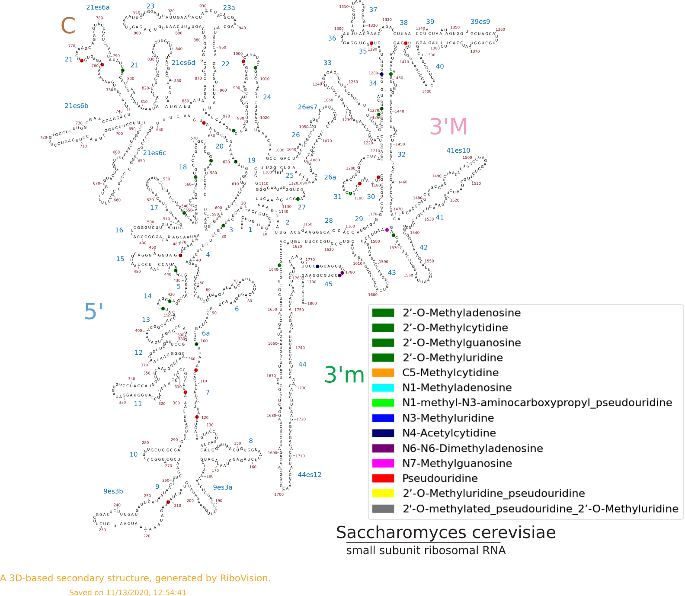
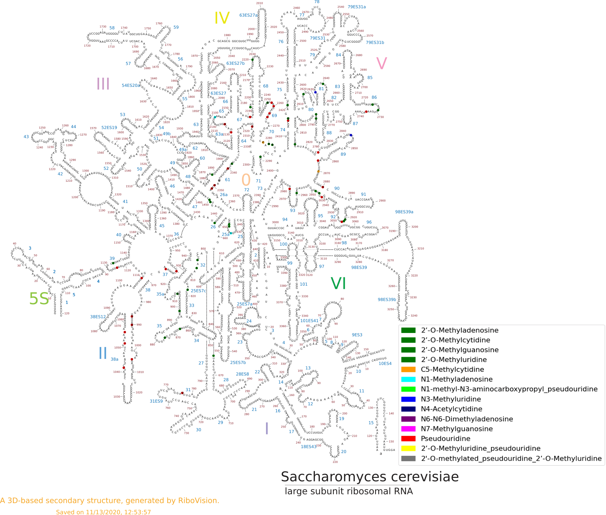

## Create csv for secondary structure visualization 
* I wanted to visualize the modifications as well as the positions of each modification so I decided on using [RiboVision](http://apollo.chemistry.gatech.edu/RiboVision/).
The [18S](ribovison_18S.csv) and [25S](ribovison_25S.csv) csv files were created in the [Preprocessing_yeast_rRNA](../../notebooks/position_file_creation.ipynb) notebook.

* 
* 

### [HOME](../../README.md)